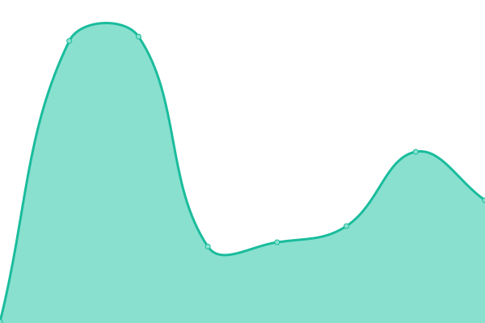
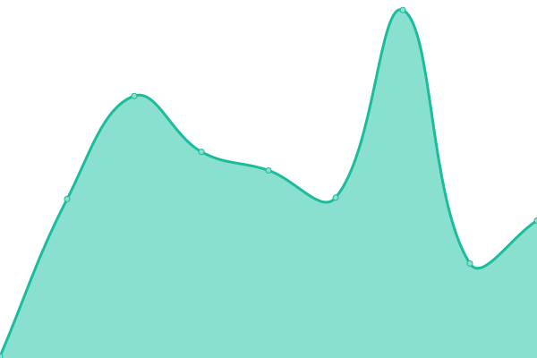

# Portfolio Tracker Status

Live uptime monitoring for Portfolio Tracker services, powered by [Upptime](https://upptime.js.org).

<!--start: status pages-->
<!-- This summary is generated by Upptime (https://github.com/upptime/upptime) -->
<!-- Do not edit this manually, your changes will be overwritten -->
<!-- prettier-ignore -->
| URL | Status | History | Response Time | Uptime |
| --- | ------ | ------- | ------------- | ------ |
|  [Portfolio Gateway](https://portfolio-gateway.onrender.com/health) | 🟩 Up | [portfolio-gateway.yml](https://github.com/LalithKamana/portfolio-status/commits/HEAD/history/portfolio-gateway.yml) | 

 10341ms
     
 | 

<a href="https://LalithKamana.github.io/portfolio-status/history/portfolio-gateway">63.33%</a>
    

|  [Portfolio Data](https://portfolio-data-tqlm.onrender.com/health) | 🟩 Up | [portfolio-data.yml](https://github.com/LalithKamana/portfolio-status/commits/HEAD/history/portfolio-data.yml) | 

 16457ms
     
 | 

<a href="https://LalithKamana.github.io/portfolio-status/history/portfolio-data">63.32%</a>
    

<!--end: status pages-->

> This README is auto-updated by Upptime every hour. Do not edit manually.
